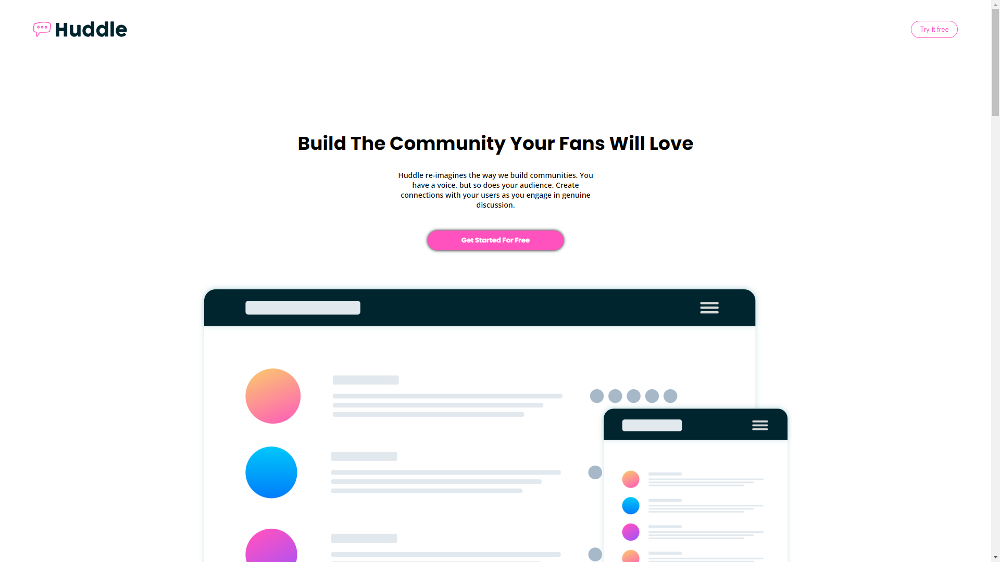

<h1 align="center">Huddle landing page</h1>

  <h3>
    <a href="https://karanpunjapatel.github.io/Huddle-landing-page-main/" color="white" target="_blank">
      Live
    </a>
   | 
        <a href="https://www.frontendmentor.io/challenges/huddle-landing-page-with-curved-sections-5ca5ecd01e82137ec91a50f2" target="_blank">
      Challenge
    </a>
  </h3>

   Solution for a challenge from  <a href="https://www.frontendmentor.io/" target="_blank">frontendmentor.io</a>.

 
 
 

## About The Project

This HTML & CSS only challenge is perfect for anyone just starting out or anyone wanting a small project to play around with.
  Your users should be able to:
 1. View the optimal layout depending on their device's screen size
 2. See hover states for interactive elements

## Built with

- Semantic HTML5 markup
- CSS custom properties
- Flexbox
- Desktop-first workflow

## What I learned

There was nothing new that I didn't know before however the postioning of svg and centering of background was a bit of a challange. But it worked out in the end.
